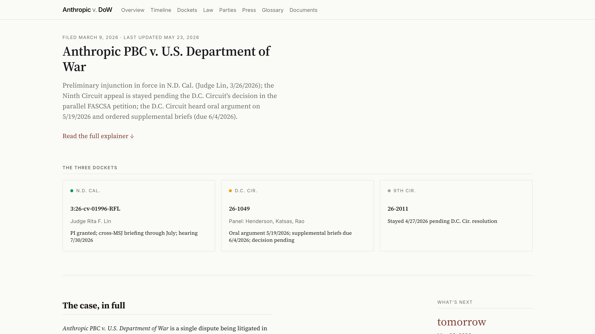
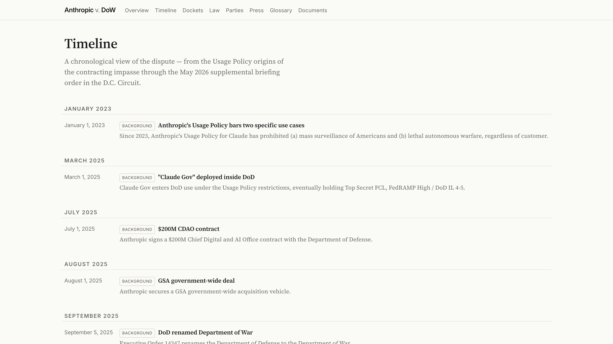
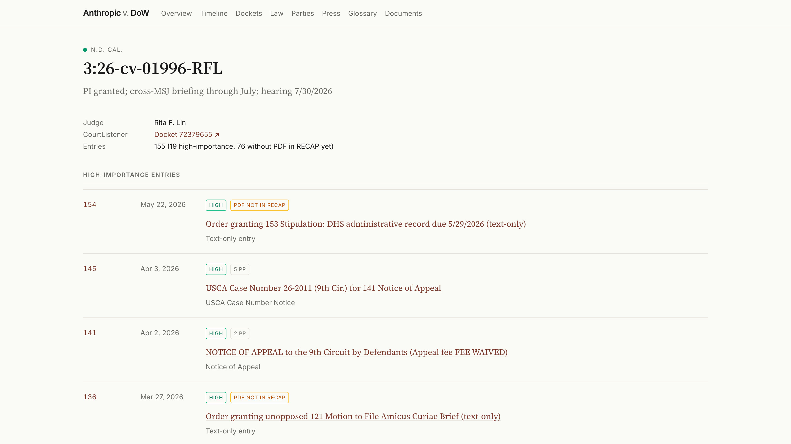

# Agent Corner: Pointing an Agent at a Pile of Data

*A new column on what coding agents are actually good for, and what they aren't. Launching with a litigation tracker that would otherwise have been too much work to build.*

By Mark Williams

---

Over a few evenings this spring I built a site that tracks *Anthropic PBC v. U.S. Department of War* in close to real time. You likely know the shape of the dispute already; what is easier to lose track of is that it is being fought on three fronts at once: the merits action in the Northern District of California, a parallel petition in the D.C. Circuit, and a stayed appeal at the Ninth. It pulls, organizes, and publishes every docket entry, deadline, and ruling, and a daily job checks all three courts for new filings. It is live at [**anthropic-v-dow.vercel.app**](https://anthropic-v-dow.vercel.app).

{width=6in}
*The home page. The three courts the case lives in sit side by side, and the "What's next" rail counts down to the next deadline in any of them.*

That site is the artifact, and you are welcome to use it. But the artifact is beside the point. This post is about how it came to exist, because the how would have been out of reach a year ago, and that is the reason I am starting this column.

## What Agent Corner is

Agent Corner is a recurring series here on *The AI of Law* about what becomes possible when you stop treating AI as a smarter search box and start treating it as a collaborator that builds things alongside you. I will work through projects in public, across legal practice, academia, and everything in between, and try to be honest about which ones were worth the effort and which were not. The aim is modest: explore real use cases and report their value, or their lack of it. This is the first.

It is also, frankly, a reaction. A lot of what passes for legal-AI commentary right now is hand-wavy: ethics hot takes and "AI literacy" think-pieces, word soup posted to the feed by people who have not built anything with the tools they are theorizing about. This is the opposite bet, a deliberate attempt at hands-on learning of the kind that AI and coding agents, for all their faults, make genuinely easy to do. The fastest way to find out what these tools are is to point one at something real and watch what comes back.

That honesty matters more now than it would have six months ago, because the mood is turning.

## The moment this arrives in

We seem to be coming off the peak of inflated expectations for this generation of coding agents and sliding into the trough of disillusionment, at least among those paying attention. [Gartner's 2026 hype cycle](https://www.gartner.com/en/articles/hype-cycle-for-agentic-ai) puts agentic AI at the peak; general-purpose generative AI is already in the trough. The headlines are catching up. This month [Microsoft began canceling internal Claude Code licenses](https://www.peoplematters.in/news/ai-and-emerging-tech/microsoft-cancels-claude-code-licences-after-engineers-use-it-too-much-49918) and steering engineers back to GitHub Copilot's CLI. The reason was not that the tool failed. Engineers leaned on it so heavily that the unit economics broke, and at current token prices that is the most credible signal yet that enterprise AI coding does not pencil out. Uber tells the same story from the other direction: it [burned through its entire 2026 AI-tools budget by April](https://fortune.com/2026/05/26/uber-coo-ai-spending-tokens-claude-code/), four months in, after rolling Claude Code out to its engineers, and its COO is now openly weighing token spend against the cost of simply hiring people. The productivity data keeps complicating the story too: near-universal adoption, single-digit gains at the team level, longer review times, rising code churn. Anyone who made maximum usage a KPI is in for a hard few months.

The advantages, in other words, still bend toward the individual. Making coding agents pay off at organizational scale is a different and much harder problem, and I expect a steady run of cautionary headlines through the summer, the Microsoft story being the first big one. A handful of teams have genuinely cracked it. Anthropic reportedly writes most of Claude Code with Claude Code, using explicit planning phases, project configuration files, aggressive verification, and parallel checkouts. But that playbook is not yet generalizable, and most organizations lack the operational discipline to copy it.

That is not the disillusioned conclusion, though. Even if these agents never improved past today, they are already profoundly useful, and they point at something larger than the demos suggest: a computer solving problems in ways that were not possible before. It is not about "building apps." If you think it is, you are missing the forest for the trees, the same mistake that turned the early excitement about ChatGPT into a wave of avoidable disappointment. And it is worth remembering, from inside the bubble, that a far larger group has no idea what any of this means. The gap between the AI most people meet day to day and where the frontier actually sits keeps widening, which leaves a lot of room for bad information and people talking past one another. Agent Corner is my attempt to narrow that gap by example, one concrete project at a time.

## Following a case the hard way

It helps to know what this replaces. The federal judiciary's official records system, [PACER](https://pacer.uscourts.gov/pacer-pricing-how-fees-work), charges ten cents a page to read public court documents, caps a single document at three dollars, and is split across roughly two hundred separate court systems, each with its own login and its own running meter. The search is weak, and the alerting is patchy enough that the dependable way to catch a new filing has long been to buy the docket again and compare it to last time. Following one case across a district court and two appellate courts means metering three of those systems at once and stitching the results into a single timeline by hand.

{width=6in}
*The work that used to be done by hand: one timeline that merges all three courts, from the Usage Policy origins of the impasse through the latest filings.* The fees are a real barrier, not a rounding error: a class action over excessive PACER charges [settled in 2024 for about $125 million](https://www.courthousenews.com/125-million-settlement-approved-in-class-action-over-excessive-pacer-fees/). The commercial products that smooth all this over, the Bloomberg Law and Lexis docket tools, run from hundreds to thousands of dollars a year, which puts comprehensive tracking out of reach for most individuals, journalists, and small nonprofits.

[CourtListener](https://www.courtlistener.com) is the quiet reason this project was possible at all. It is run by the [Free Law Project](https://free.law), a nonprofit, and it has spent years building the largest open collection of federal court data anywhere: more than 99 percent of American precedential case law, a vast archive of dockets, oral-argument audio, judge records, and the [RECAP Archive](https://free.law/recap/), which turns PACER documents that someone already paid for into a free copy for everyone else. It offers a free API token, bulk downloads, and free docket alerts. And it keeps getting better. In 2025 it added [search alerts that work like Google Alerts for new federal filings](https://www.lawnext.com/2025/06/courtlistener-launches-recap-search-alerts-for-pacer-filings-google-alerts-for-federal-courts.html), and [the reporting that exposed more than 130 federal judges](https://www.abajournal.com/news/article/131-federal-judges-oversaw-cases-involving-companies-in-which-they-or-their-families-owned-stock) who had ruled on cases they held a financial stake in was built on its data. This is what it looks like when someone decides that public records should actually be public. It runs on donations and grants rather than fees, so if you get value from it, consider [supporting their work](https://free.law/donate/).

## What actually happened

I did not write the code. I pointed a coding agent at a pile of data and told it what I wanted.

The pile was CourtListener's API. A year ago, using it meant reading the documentation, learning its authentication and pagination, writing a script to walk the endpoints, and working out how its JSON mapped onto the thing I actually cared about. I know how to do that. It is also exactly the kind of work that sits between me and the question I want answered, and it is enough work that, for a side project, I would simply never have started.

<!-- SCREENSHOT (capture manually, since CourtListener blocks headless/automated screenshots with a CloudFront 403): open the raw docket in a normal browser, e.g. https://www.courtlistener.com/docket/72380208/anthropic-pbc-v-united-states-department-of-war/ (D.C. Cir.) or 72379655 (N.D. Cal.), capture the long undifferentiated entry list, save as images/courtlistener-docket.png, then replace this comment with: {width=6in} -->
*Before: the raw CourtListener docket. Every entry is here, in order, with nothing marking which ones matter.*

This time the agent did not even have to write that script. CourtListener is wired into it as a connector, so for the work of exploring and pulling the case it never touched the API in the hand-built sense. I asked for the case and it reached the data directly, the way you would ask a research assistant who already had the database open. The endpoints, the authentication, the paging all sat below the level I had to think about. That layer is newer than the agents themselves, and it is a good part of why a project like this now reads as an evening's work rather than a small engineering effort.

Instead I described what I was after, and the agent pulled the dockets and showed me what it found. What it found corrected me. I had described this as a single D.C. Circuit case. The agent came back with three parallel proceedings: the merits action in California, a separate FASCSA petition in the D.C. Circuit, and the government's stayed appeal at the Ninth. It showed me how they fit together. Had I built around my own framing, the site would have understated the dispute by two-thirds. The agent was not just fetching faster. It was organizing raw material into the shape of the actual problem.

From there it kept going. It parsed the filings, drafted the explanatory prose, structured every fact into data files the site reads, and stood up a daily job that watches the three dockets and appends new entries on its own. Wrangler, organizer, synthesizer, visualizer: that is the role the agent played, and I suspect it is the role most people will find it most useful in.

{width=6in}
*After: the same docket on the tracker. The agent read every entry, classified each one by importance, pulled the high ones to the top, and left the rest searchable below. A "PDF not in RECAP yet" badge appears where the document has not been freed from PACER.*

## The actual unlock

Being able to point a coding agent at a pile of data, whether an API, a bulk download, or a folder of PDFs, and have it read the documentation, pull what matters, and organize it for you is a genuine new capability for the many people who never had the time or the inclination to learn the particulars of programmatic data access. The computer now completes a task that used to carry so much friction that it was either not worth doing or out of reach entirely. Tracking this litigation at this level of detail would have been a great deal of work, maybe too much. Built this way, it was nearly frictionless.

I want to be careful here, because there is a real argument on the other side. We should jealously guard much of our own cognition and stay wary of offloading it. But abstracting away the plumbing to reach the actual docket analysis faster is a trade worth making. And there is a second cost worth naming. Each step of abstraction, from writing the script myself to letting a connector reach the data for me, leans harder on someone else's integration and shows me less of the plumbing. I am comfortable with that here. I would not be everywhere. Knowing how to use an API is a real skill, and I am glad I have it. For most of the work in front of me, though, being able to set that skill aside and get straight to the data matters more. For a lot of us, that abstraction is the difference between doing the thing and not doing it at all.

## What transfers, and what does not

The core move transfers completely. You can wrangle any docket this way, and any body of public data with a way in. The specifics travel less well, and I should be honest about that. Not every feature I built belongs on every tracker; a quiet single-defendant case does not need a three-court timeline, and some of what I built I will rebuild. The same goes for the trimmings. The agent cheerfully produced a glossary of the statutes and doctrines in play, a Law page breaking holdings, claims, and issues apart, a parties roster with counsel, and a curated news feed. It was genuinely interesting how easily it generated all of that, and just as telling how little of it a given case actually needs. Trivial to add is not the same as worth adding; for a simpler matter I would leave most of it out. Nothing here is finished or perfect. But the pattern underneath is the part that repeats: point the agent at the source, make it read the documentation, and have it show you the structure of the data before you commit to a design. The artifact changes from case to case. The method holds.

None of it runs without a person who knows what they want. The agent corrected my framing, but I made every editorial call: what the site should contain, which deadlines matter, where a primary source needed quoting in full and where a summary would do. When the agent proposed a more elaborate architecture than the project needed, I was the one who had to decide whether to live with maintaining it. The tools produce the artifact. They do not decide what is worth making.

That is the through-line for Agent Corner. The tools are capable now, the hype is deflating, and the honest question is finally the interesting one: what are they actually good for, and what aren't they? What they amount to depends on what we point them at. This tracker is one answer. I will keep posting the others, the disappointments included.

---

*Have a pile of data you have been meaning to do something with: a docket, a dataset, a folder you keep promising yourself you will get to? Drop it in the comments. A future Agent Corner will pick one and work through how I would approach it.*

*Disclosures: Anthropic makes the coding agent I used here. I have no financial relationship with the company; I am a faculty user. The tracker is a public resource of the Vanderbilt AI Law Lab and is not affiliated with Anthropic or any party in the case. The site's code is MIT-licensed and its prose is CC-BY; both are open at [github.com/willimj3/anthropic-v-dow](https://github.com/willimj3/anthropic-v-dow).*

*Sources, AI economics: "Microsoft cancels Claude Code licences after engineers use it too much" (People Matters); "Microsoft's quiet Claude Code retreat and the real cost of enterprise AI" (TNW); "The AI Productivity Paradox: 93% Adoption, 10% Gains" (Dubach); METR, "We are Changing our Developer Productivity Experiment Design"; Gartner, "2026 Hype Cycle for Agentic AI"; "Uber burned through its entire 2026 AI budget in four months" (Fortune).*

*Sources, dockets and access: PACER fee schedule (pacer.uscourts.gov); the $125M PACER-fee class settlement, National Veterans Legal Services Program v. United States (final approval 2024); Free Law Project and CourtListener coverage and API docs (free.law, courtlistener.com); "CourtListener Launches RECAP Search Alerts for PACER Filings" (LawSites, 2025); The Wall Street Journal's investigation into federal judges' financial-conflict violations. Pricing and archive figures shift, so confirm current numbers before publishing.*
